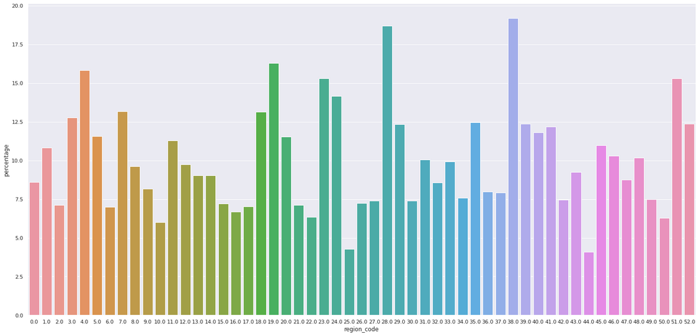

 

# Insurance All Company - Health Insurance Cross Sell

The following context is completely fictitious, the company, the context and the CEO. The business questions are also fictional but were made in an attempt to exemplify how they would be required in a business work environment.

# Introduction
This is an end-to-end classification data science project made to a company called Insurance All, whose objective is to offer its health insurance customers a new product: auto insurance. The main goal of our project is to rank the customers most likely to purchase this new product in order to optimize the sale's team effectiveness by making only contacts with customers most likely to purchase. More detailed information can be found in the Description section.

This project is part of the "DS Community", which is a study environment that promotes the learning, execution, and discussion of Data Science projects.

### Solution Planning

* [1. Description and Business Problem ](#1-description-and-business-problem)
* [2. Database and Business Assumptions](#2-database-and-business-assumptions)
* [3. Solution Strategy ](#3-solution-strategy)
* [4. Top 4 Data Insights ](#4-top-4-data-insights)
* [5. Machine Learning Model Selection](#5-machine-learning-model-selection)
* [6. Model Performance ](#6-model-performance)
* [7. Business Results](#7-business-results)
* [8. Model in Production ](#8-model-in-production)
* [9. Conclusion](#9-conclusion)
* [10. Learning and Future Work](#10-learning-and-future-work)

# 1. Description and Business Problem

## 1.1 Description and Context
Insurance All is a company that provides health insurance to its customers. The product’s team is analyzing the possibility of offering a new product to the insurance customer: auto insurance. Like health insurance, the customers of this new auto insurance plan need to pay an amount annually to Insurance All to obtain an amount insured by the company, intended for the costs of an eventual accident or damage to the vehicle.

Insurance All surveyed nearly 380.000 customers about their interest in acquiring the new product , the auto insurance. All the clients showed interest or not in purchasing auto insurance and these responses were saved in a database along with other customer attributes.

The product team selected 127.000 new customers who didn’t respond to the survey to participate in a campaign, in which they will be offered the new auto insurance product. The offer will be made by the sales team through phone call. 

**However, the sales team only has the capability to make 20.000 calls within the campaign duration.***

## 1.2 The Challenge

As a result of your consultancy, you will need to deliver a report containing some analysis and answers to the following questions:

Main Insights of the most relevant attributes of the customers that are interested in purchasing auto insurance.

What percentage of customers' interest in purchasing auto insurance will the sales team be able to reach by making 20.000 calls?

If the sales team’s capacity increases to 40.00 calls, what would be the percentage of people interested in purchasing a new auto insurance the sales team would be able to reach out.

How many calls does the sales team need to make contact to 80% of the customers interested in purchasing auto insurance?

## 1.3 Business Problem

In that context, you were hired as a Data Scientist Consultant to build a model that predicts if the cliente would be interested or not in purchasing the new auto insurance. With your solution, the sales team expect to prioritize the customers with more propense in obtaining the new product and, thus, optimize the campaign by making only contacts with customers most likely to purchase.

As a result of your consultancy, you will need to deliver a report containing some analysis and answers to the following questions:

- Main Insights of the most relevant attributes of the customers that are interested in purchasing auto insurance.

- What percentage of customers' interest in purchasing auto insurance will the sales team be able to reach by making 20.000 calls?

- If the sales team’s capacity increases to 40.00 calls, what would be the percentage of people interested in purchasing a new auto insurance the sales team would be able to reach out.

- How many calls does the sales team need to make contact to 80% of the customers interested in purchasing auto insurance?

## 1.4 Solution Planning 

#### What is the solution and how will it be delivered?
The development of a machine learning model that ranks the customers based in his probability (propensity score) to purchase the new auto insurance. 

The Final Model will be available in an API, and may be used by the Company in any time needed.

#### Hosting 
The model will be hosted in a Heroku Environment and is available in the url: https://health-insurance-jbm.herokuapp.com/

#### Delivery Method and Google Sheets  
A script was developed in Google Sheets in which the input data are the attributes and information of the customers, and when executing the script it queries the model in the Heroku environment and returns the probability of the customer to acquire the new auto insurance.

The Google Sheets Spreadsheet its located at: https://docs.google.com/spreadsheets/d/164sfg8vRjYGQ_k-3QX85D-L4Pf6gdf-alpOwOTJpJcY/edit?usp=sharing

# 2. Database and Business Assumptions

The dataset is located in an AWS environment where the customer database and their information are located. To extract these data, SQL queries were used to organize the data for the project solution. Each row represents a customer and each columns contains some attributes that describe that customer, in addition to their survey response, in which they mentioned their interest or not in purchasing the new insurance product.

The attributes of each customer can be described by:

* **Id**  unique customer identifier.
* **Gender** - customer's gender.
* **Age** - customer 's age.
* **Driving License** - 0, the customer does not have a driving license and 1, the customer has a driving license.
* **Region Code** - Customer's region code.
* **Previously Insured** - 0, the customer does not have auto insurance and 1, the customer already has auto insurance.
* **Vehicle Age** - vehicle age.
* **Vehicle Damage** - 0, customer has never had his vehicle damaged in the past and 1, customer has had his vehicle damaged in the past.
* **Annual Premium** - amount the customer paid the company for annual health insurance.
* **Policy sales channel** - anonymous code for the customer contact channel.
* **Vintage** - number of days that the customer was associated with the company through the purchase of health insurance.
* **Response** - 0, the customer is not interested and 1, the customer is interested.

# 3. Solution Strategy 

### Step 01. Data Description
In this step, some aspects of the dataset were verified, such as: column names, dimensions, data types, checking and filling in missing data (NA), descriptive analysis of the data and what are its categorical variables.

### Step 02. Featuring Engineering
In featuring engineering, new attributes (columns) were derived based on the original variables, enabling a better description of the phenomenon of that variable.

### Step 03. Filtering Variables
Checking the necessity to filter the dataset based on a variable that does not matter to the project itself.

### Step 04. Exploratory Data Analysis (EDA)
Exploration of Data in order to find Insights for a better understanding of the Business. Univariate, bivariate and multivariate analyzes were also performed, obtaining some statistical properties that describe them, and more importantly, the correlation between the variables.

### Step 05. Data Preparation
Session that deals with the preparation of data so that Machine Learning algorithms can be applied. Some types of scaling and encoding were performed so that the categorical variables became numerical.

### Step 06. Selection of Algorithm Variables
The selection of attributes was performed using the Feature Importance method of based tree algorithms. In which the most significant attributes were selected so that the model's performance was maximized.

### Step 07. Machine Learning Model
Training of Machine Learning models. The model that presented the best performance against the database with applied cross-validation proceeded to the hyper parameterization of the variables of that model, aiming to optimize the generalization of the model.

### Step 08. Hyper Parameter Fine Tuning
The best parameters were found that maximize model learning. These parameters were defined by using the Optuna framework for automating the optimization process of these hyperparameters. It automatically searches for and finds optimal hyperparameter values by trial and error for excellent performance. 

### Step 09. Conversion of Model Performance into Business Value
In this step, the performance of the model was analyzed from a business perspective, and translated into business value.

### Step 10. Deploying the Model to Production
Publication of the model in a production environment in the cloud (Heroku) so that people or services can access the results and thus improve the company's business decision.

### Step 11. Google SpreadSheets
A script was developed in Google Sheets in which the input data are the attributes and information of the customers and the outcome of that script is a table with the customers attributes and his propension to purchase the new auto insurance.

# 4. Top 4 Data Insights 

### **H3.** Most customers under the age of 35 are not interested in insurance.
***TRUE*** - Customers under the age of 35 are the ones with the least interest in insurance. Approximately only 24%.

### **H6.** Customers with a history of crashed cars tend to be interested in insurance.
***TRUE*** - 98% of the customers that has interest in purchasing the auto insurance had already crashed their car

### **H7.** Customers with new vehicles tend to be more interested in insurance.
***FALSE*** - The customers with vehicles between 1 and 2 years are the ones with the most interest in insurance.

### **H11**. Clientes that are located in a specific region tend to have more interest in insurance.
***TRUE*** - Clients that are located in region codes (28,38) have more interest in insurance.

# 5. Machine Learning Model Selection

The following Machine Learning Models were implemented, all of them applied to a classification problem:
* KNN Classifier.
* Logistic Regression.
* Gaussian Naive Bayes.
* Random Forest Classifier.
* Light Gradient Boosting Machine Classifier.
* XGBoost Classifier.

# 6. Model Performance
For measuring the performance of the models we will use the cross-validation method which prevents the model from overfitting when the model receives some data that he has never seen before. The @K for the metrics of Ranking-To-Learn approach is 20.000 and will better explained in the business results in the next section.

|Model Name				|Accuracy Balanced  |Precision @K Mean	|Recall @K Mean |	ROC AUC Score	|Top K Score|
|	:---:					|			:--:		|			:--:		|			:--:	|		:--:			|		:--:	|
|**LGBMClassifier**		|	0.500212	|0.310044|	**0.827842**	|**0.854041**	|**0.876922**|
|**XGBClassifier**			|	0.506054		|	0.308755		|	**0.824398**	|	**0.852193**		|**0.876417**	|
|**RandomForestClassifier**	|	0.543595		|	0.292315		|	**0.780504**	|	**0.831379**		|**0.864274**	|
|GaussianNB				|	0.783845		|	0.290275		|	0.775058	|	0.825276		|0.637836	|
|LogisticRegression		|	0.500000		|	0.275936		|	0.736771	|	0.817035		|0.877154	|
|KNeighborsClassifier	|	0.523210		|	0.285636	    |	0.762669	|	0.803941		|0.870726|

So we selected LGBM, XGBoost and Random Forest Classifiers to proceed to the Hyper-Parameter-Fine-Tuning, after the optimization of the parameters for each model we compared their model performance by plotting their Gain Curve.

|Model Name	|ROC AUC	|Top @K Acc|
|--: |--:| --:|
|XGB Classifier Tuned |	0.857739|	0.878526|

|Model Name	|ROC AUC	|Top @K Acc|
|:--: |:--:| :--:|
|**LGBM Classifier Tuned**	|**0.858096**|**0.878539**|

|Model Name	|ROC AUC	|Top @K Acc|
|:--: |:--:| :--:|
|Random Forest Classifier Tuned|	0.85644	|0.878565|

As all the models perform similarly, we will choose the model whose size of the model object is the smallest, which in this case is the LGBM Classifier.

|Model | Object Size |
|:--:|:---:|
|Random Forest|29248.79 KB|
|XGBoost | 1085.06 KB|
|***LGB*** |***314.09 KB***|

# 7. Business Results
Now, with the final model implemented, the business questions of the initial problem of the Insurance All company will be answered.
## 7.1 Business Questions 
### Q1. What percentage of customers' interest in purchasing auto insurance will the sales team be able to reach by making 20.000 calls?

By making 20.000 calls, which correspond to 26.24% of our validation dataset, the sales team would be able to reach 72,08% of people interested in purchasing a new car insurance.

Making 20.000 calls, the model proposed is about 2.75 times better than a random choice

### Q2. If the sales team’s capacity increases to 40.00 calls, what would be the percentage of people interested in purchasing a new auto insurance the sales team would be able to reach out.

By making 40.000 calls, which correspond to 52.48% of our validation dataset, the sales team would be able to reach 99,44% of people interested in purchasing a new car insurance.

Making 40.000 calls, the model proposed is about 1.9 times better than a random choice

### Q3. How many calls does the sales team need to make contact to 80% of the customers interested in purchasing auto insurance?

To make contact to the 80% customers interested in purchasing an auto insurance the sales team needs make 23.300 calls, which correspond to 30.56% of the validation dataset

## 7.2 Revenue Business Performance
- So, if we take all the customers from the validation dataset there are in total 76.222 clients. Now we are going to calculate the revenue that would be generated from this dataset according to the requested business questions with the fixed price of an insurance as U$2000,00 per year and not putting in the matter the cost of each call to reach a client.

For comparison purposes we are taking a "random" model representation, which could be a simple ordination of the list by age or some other specific attribute of the features.

**PS: All the assumptions of values are just fictional and do not translate a real word behavior.**

### 7.2.1 Revenue for 20.000 calls

|Model | People Reached | Total People Interested | Revenue |
|:---: | :-------------:|:-----:|:----|
| Random Model    |2428| 9256 | U$4.856.000,00|
| Suggested Model |6671| 9526 | U$13.342.000,00|
| Difference Between Models | 4243| ---- | U$9.138.000,00|

### 7.2.2 Revenue for 40.000 calls

|Model | People Reached | Total People Interested | Revenue |
|:---: | :-------------:|:-----:|:----|
| Random Model    |4857| 9256 | U$9.714.000,00|
| Suggested Model |9204| 9526 | U$18.408.000,00|
| Difference Between Models | 4347| ---- | U$8.694.000,00|

### 7.2.3 Revenue for 80% of interest people of the dataset 
To reach the 80% would be necessary 23.350 calls.

|Model | People Reached | Total People Interested | Revenue |
|:---: | :-------------:|:-----:|:----|
| Random Model    |2835| 9256 | U$5.670.000,00|
| Suggested Model |7404| 9526 | U$14.808.000,00|
| Difference Between Models | 4569| ---- | U$9.138.000,00|

# 8. Model in Production
The model was deployed on Render (https://jbm-health-insurance-model.onrender.com) and its available in Google Sheets (https://docs.google.com/spreadsheets/d/164sfg8vRjYGQ_k-3QX85D-L4Pf6gdf-alpOwOTJpJcY/edit#gid=0). 

The Google Sheet can be accessed by any user with a google account and can be used to establish a ranking of customers most likely to purchase vehicle insurance, with direct production data.

In the header of the Google Sheet there is a button called Health-Insurance-Propense-Score, once activated, returns the scores based on the propensity to that customer purchases a new insurance car.

# 9. Conclusion
In this project, all the necessary steps were taken to implement a complete Data Science project in a production environment. The project management method called CRISP-DM/DS was used and a satisfactory performance was obtained using the LGBM Classifier model to rank the most likely customers to obtain the new product of the Insurance All Company: auto insurance.

Some Business Insights were generated during Exploratory Data Analysis that helped the CEO, the business team and the data scientist to better understand the business. In view of these results, the project achieved its objective of finding an assertive solution for ranking the customers in order to optimize the sales team's effectiveness to contact its customers.

With the model in production, it is expected to be at least 2.5x more effective in getting customers to purchase the new product of auto insurance of the Insurance All Company. To reach about 93% of the people interested in acquiring the auto insurance is needed to reach out to only 40% of the customers in the database.

# 10. Learning and Future Work
**Learning**
* This project was a Classification project with a Learning To Rank approach, since we have to order the customers based on their propensity score to purchase the new product.
* It is extremely important to analyze the problem core so we can use the most appropriate metric to measure the performance of the model. In this case, we are not looking at the most "common" metrics when it comes to classification problems.
* Selecting the most simple model with adequate performance is more important than making a model that is more accurate but it's too complex and heavy. 

**Future Works**
* Make new features that could explain more efficiently the phenomenons of the problem.
* Use another type of encoder in the preparation of the data.
* Try balancing data and how it impacts the performance of the model.

